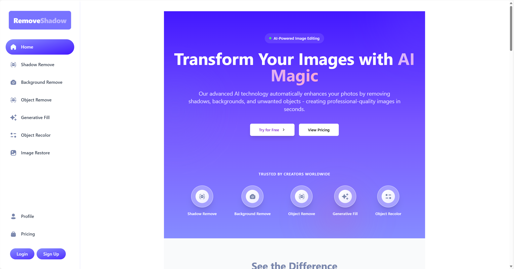

## 声明
本项目基于 JavaScript Mastery 的教程项目进行开发和改进。在原项目基础上，我进行了以下改进：

- 替换Stripe支付为Creem支付系统
- 对clerk用户认证模块的代码进行了更新
- 完善了项目页面，如about,contact,privacy等多个页面
- 添加了removeshadow功能，即使用remove object功能，预设提示词为shadow
- 进行了SEO优化

### 原项目链接
- 教程视频: [Build and Deploy a Full Stack AI SaaS Platform with Next js 14, TypeScript, Stripem](https://www.youtube.com/watch?v=Ahwoks_dawU&t)
- 原始仓库: [project_ai_saas](https://github.com/adrianhajdin/ai_saas_app)

# RemoveShadow - AI图像处理平台

RemoveShadow是一个专业的AI图像处理平台，专注于提供高质量的图像优化服务。我们的核心技术能够智能检测并消除照片中的不需要的阴影，为电子商务、房地产、摄影等领域的专业人士创建干净、专业的图像。

项目网页地址：https://removeshadow.com

## 主要功能

- **阴影去除**：智能识别并移除图像中的阴影，保持原始图像质量
- **背景去除**：一键移除图像背景，创建透明或自定义背景
- **物体去除**：智能擦除图像中不需要的物体，自动填充背景
- **图像修复**：修复老旧或损坏的照片，恢复图像质量
- **物体颜色修改**：精确更改图像中特定物体的颜色
- **生成式填充**：使用AI技术智能填充图像中的空白区域

## 技术栈

- **前端**：Next.js 14, React, Tailwind CSS
- **后端**：Next.js API Routes, MongoDB
- **认证**：Clerk Authentication
- **支付处理**：Creem Payment Gateway
- **图像处理**：Cloudinary API
- **部署**：Vercel

## 本地开发

### 前提条件

- Node.js 18+
- MongoDB账户
- Clerk账户
- Cloudinary账户
- Creem支付账户

### 环境变量设置

创建一个`.env`文件，包含以下变量：
# Clerk Key
NEXT_PUBLIC_CLERK_PUBLISHABLE_KEY=
CLERK_SECRET_KEY=

# Clerk Urls
NEXT_PUBLIC_CLERK_SIGN_IN_URL=/sign-in
NEXT_PUBLIC_CLERK_SIGN_UP_URL=/sign-up
NEXT_PUBLIC_CLERK_AFTER_SIGN_IN_URL=/
NEXT_PUBLIC_CLERK_AFTER_SIGN_UP_URL=/

# Webhooks Secret
WEBHOOK_SECRET=

# MongoDB
MONGODB_URL=

# cloudinary
NEXT_PUBLIC_CLOUDINARY_CLOUD_NAME=
CLOUDINARY_API_KEY=
CLOUDINARY_API_SECRET=

# Creem
CREEM_API_KEY=
CREEM_API_LOCATION=
NEXT_PUBLIC_CREEM_STARTER_PRODUCT_ID=
NEXT_PUBLIC_CREEM_BASIC_PRODUCT_ID=
NEXT_PUBLIC_CREEM_PRO_PRODUCT_ID=
NEXT_PUBLIC_CREEM_BUSINESS_PRODUCT_ID=
NEXT_PUBLIC_CREEM_ENTERPRISE_PRODUCT_ID=

## 🚀 快速开始
# 克隆项目并安装依赖:
git clone https://github.com/chatgptsuper/remove-shadow-ai.git
npm install

# 改为你自己的域名
NEXT_PUBLIC_SERVER_URL=https://removeshadow.com

# 启动开发服务器:
npm run dev

## 🔑 主要功能说明
### 图像处理
- 支持多种图像转换效果
- 实时预览
- 批量处理能力
### 用户系统
- 安全的用户认证
- 个人资料管理
- 积分余额查询
### 支付系统
- 灵活的套餐选择
- 安全的支付流程
- 积分自动充值

